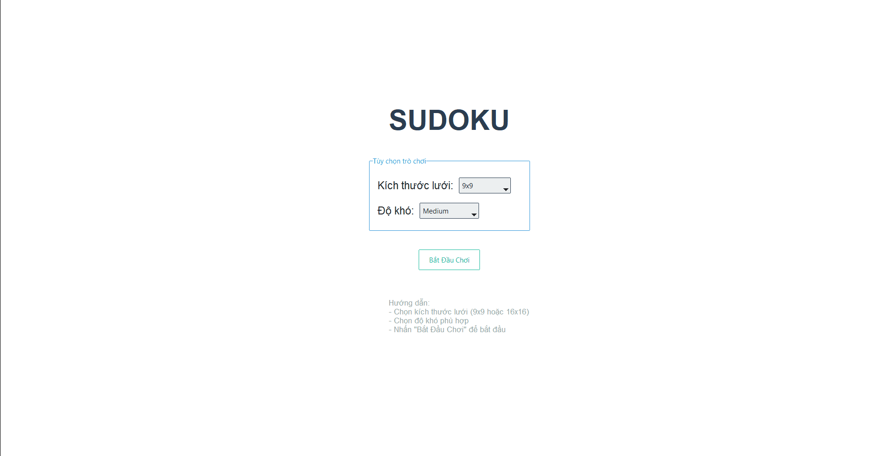

# Đồ Án Môn Học: Trí Tuệ Nhân Tạo
## Giải Sudoku Sử Dụng Nhiều Thuật Toán Khác Nhau

### Thông Tin Đồ Án
- **Môn học:** Trí Tuệ Nhân Tạo
- **Giảng viên:** TS. Phan Thị Huyền Trang
- **Lớp học phần:** ARIN330585_05

### Mục Lục
1. [Giới Thiệu Về Sudoku](#giới-thiệu-về-sudoku)
2. [Tổng Quan Dự Án](#tổng-quan-dự-án)
3. [Phân Tích Vấn Đề](#phân-tích-vấn-đề)
4. [Các Thuật Toán Được Sử Dụng](#các-thuật-toán-được-sử-dụng)
5. [Kiến Trúc Hệ Thống](#kiến-trúc-hệ-thống)
6. [Kết Quả và Đánh Giá](#kết-quả-và-đánh-giá)
7. [Hướng Dẫn Sử Dụng](#hướng-dẫn-sử-dụng)
8. [Kết Luận và Hướng Phát Triển](#kết-luận-và-hướng-phát-triển)
9. [Tài Liệu Tham Khảo](#tài-liệu-tham-khảo)

### Giới Thiệu Về Sudoku

#### Lịch Sử và Nguồn Gốc
Sudoku là một trò chơi giải đố số học phổ biến, được phát minh bởi Howard Garns vào năm 1979. Ban đầu được gọi là "Number Place", trò chơi này đã trở nên phổ biến toàn cầu sau khi được giới thiệu tại Nhật Bản vào năm 1984 với tên gọi "Sudoku" (数独), có nghĩa là "số đơn lẻ".

#### Quy Tắc và Cách Chơi
Sudoku được chơi trên một lưới 9x9, được chia thành 9 khối 3x3. Mục tiêu của trò chơi là điền các số từ 1 đến 9 vào các ô trống sao cho:
- Mỗi hàng chứa các số từ 1 đến 9, không trùng lặp
- Mỗi cột chứa các số từ 1 đến 9, không trùng lặp
- Mỗi khối 3x3 chứa các số từ 1 đến 9, không trùng lặp

#### Độ Phức Tạp và Thách Thức
Sudoku là một bài toán NP-đầy đủ, có nghĩa là không có thuật toán đa thức thời gian nào có thể giải quyết tất cả các trường hợp. Điều này làm cho Sudoku trở thành một bài toán lý tưởng để nghiên cứu và so sánh các thuật toán khác nhau trong trí tuệ nhân tạo.

### Tổng Quan Dự Án

#### Mục Tiêu
Dự án này nhằm mục đích:
1. Xây dựng một ứng dụng Sudoku hoàn chỉnh với giao diện người dùng thân thiện
2. Triển khai và so sánh hiệu quả của nhiều thuật toán giải Sudoku khác nhau
3. Phân tích và đánh giá hiệu suất của từng thuật toán
4. Mô hình hóa việc tương tác giữa máy và người chơi qua việc giải tự động

#### Phạm Vi
- Hỗ trợ bảng 9x9 và 16x16
- Nhiều mức độ khó khác nhau
- Giao diện đồ họa trực quan
- Hệ thống theo dõi và phân tích hiệu suất

### Phân Tích Vấn Đề

#### Các Thách Thức Kỹ Thuật
1. **Tính Phức Tạp của Thuật Toán**
   - Thời gian thực thi
   - Sử dụng bộ nhớ
   - Khả năng mở rộng

2. **Giao Diện Người Dùng**
   - Thiết kế trực quan
   - Phản hồi thời gian thực
   - Hỗ trợ nhiều kích thước bảng

3. **Tối Ưu Hóa Hiệu Suất**
   - Cân bằng giữa tốc độ và độ chính xác
   - Xử lý các trường hợp đặc biệt
   - Tối ưu hóa bộ nhớ

### Các Thuật Toán Được Sử Dụng

#### 1. DFS (Depth-First Search)
- **Nguyên lý hoạt động:** Tìm kiếm theo chiều sâu, đi sâu nhất có thể theo một nhánh trước khi quay lui
- **Ưu điểm:** Sử dụng ít bộ nhớ, hiệu quả cho các bài toán có giải pháp gần gốc
- **Nhược điểm:** Có thể mất nhiều thời gian cho các bài toán phức tạp

#### 2. BFS (Breadth-First Search)
- **Nguyên lý hoạt động:** Tìm kiếm theo chiều rộng, khám phá tất cả các nút ở cùng một mức trước khi đi sâu hơn
- **Ưu điểm:** Tìm được giải pháp ngắn nhất
- **Nhược điểm:** Tiêu tốn nhiều bộ nhớ

#### 3. Backtracking
- **Nguyên lý hoạt động:** Quay lui có hệ thống, thử các giá trị có thể và quay lui khi gặp ngõ cụt
- **Ưu điểm:** Hiệu quả cho các bài toán có ràng buộc
- **Nhược điểm:** Có thể mất nhiều thời gian cho các bài toán phức tạp

#### 4. Simulated Annealing
- **Nguyên lý hoạt động:** Mô phỏng quá trình ủ kim loại, cho phép chấp nhận các giải pháp tạm thời kém hơn
- **Ưu điểm:** Có thể tìm được giải pháp gần tối ưu
- **Nhược điểm:** Không đảm bảo tìm được giải pháp tối ưu

#### 5. A* Search
- **Nguyên lý hoạt động:** Sử dụng hàm heuristic để hướng dẫn tìm kiếm
- **Ưu điểm:** Hiệu quả và đảm bảo tìm được giải pháp tối ưu
- **Nhược điểm:** Phụ thuộc vào chất lượng của hàm heuristic

#### 6. AND/OR Tree Search
- **Nguyên lý hoạt động:** Sử dụng cấu trúc cây AND/OR để biểu diễn và giải quyết vấn đề
- **Ưu điểm:** Hiệu quả cho các bài toán có cấu trúc phân cấp
- **Nhược điểm:** Phức tạp trong việc triển khai

#### 7. Deep Q-Network (DQN)
- **Nguyên lý hoạt động:** Sử dụng học tăng cường sâu để học cách giải Sudoku
- **Ưu điểm:** Có khả năng học và cải thiện theo thời gian
- **Nhược điểm:** Yêu cầu nhiều dữ liệu huấn luyện và tài nguyên tính toán

### Kiến Trúc Hệ Thống

#### Mô Hình MVC
1. **Model (sudoku_model.py)**
   - Quản lý dữ liệu Sudoku
   - Xử lý logic nghiệp vụ
   - Tương tác với các thuật toán giải

2. **View (sudoku_view.py)**
   - Giao diện người dùng
   - Hiển thị bảng Sudoku
   - Xử lý tương tác người dùng

3. **Controller (sudoku_controller.py)**
   - Điều phối giữa Model và View
   - Xử lý logic điều khiển
   - Quản lý luồng dữ liệu

#### Các Module Chính
- `DO_AN_MONHOC.py`: Điểm khởi đầu của ứng dụng
- `slove.py`: Chứa các thuật toán giải Sudoku
- Các module phụ trợ khác

### Kết Quả và Đánh Giá

#### Hiệu Suất Các Thuật Toán
1. **Thời Gian Thực Thi**
   - So sánh thời gian giải quyết
   - Phân tích độ phức tạp
   - Đánh giá khả năng mở rộng

2. **Sử Dụng Tài Nguyên**
   - Bộ nhớ sử dụng
   - CPU utilization
   - Hiệu quả tính toán

3. **Độ Chính Xác**
   - Tỷ lệ thành công
   - Chất lượng giải pháp
   - Độ tin cậy

### Hướng Dẫn Sử Dụng

#### Yêu Cầu Hệ Thống
- Python 3.x (Khuyến nghị Python 3.8 trở lên)
- Các thư viện cần thiết:
  - tkinter (thường đã được cài đặt sẵn với Python)
  - ttkbootstrap
  - numpy
  - matplotlib
  - statistics
  - collections

#### Cài Đặt Chi Tiết
1. **Tải và Cài Đặt Python**
   - Truy cập [python.org](https://www.python.org/downloads/)
   - Tải phiên bản Python 3.x mới nhất
   - Trong quá trình cài đặt, đảm bảo tích chọn "Add Python to PATH"

2. **Tải Mã Nguồn**
   - Clone repository hoặc tải file ZIP từ repository
   - Giải nén vào thư mục mong muốn

3. **Cài Đặt Các Thư Viện Cần Thiết**
   ```bash
   # Mở Command Prompt hoặc Terminal
   # Di chuyển đến thư mục chứa mã nguồn
   cd đường/dẫn/đến/thư/mục

   # Cài đặt các thư viện cần thiết
   pip install ttkbootstrap
   pip install numpy
   pip install matplotlib
   ```

4. **Chạy Chương Trình**
   ```bash
   # Đảm bảo bạn đang ở thư mục chứa mã nguồn
   python DO_AN_MONHOC.py
   ```

#### Cấu Trúc Module
1. **Module Chính**
   - `DO_AN_MONHOC.py`: File khởi động ứng dụng, chứa class SudokuApp và hàm main
   - `sudoku_model.py`: Quản lý dữ liệu và logic nghiệp vụ của Sudoku
   - `sudoku_view.py`: Xử lý giao diện người dùng và hiển thị
   - `sudoku_controller.py`: Điều phối tương tác giữa Model và View
   - `slove.py`: Chứa các thuật toán giải Sudoku

2. **Module Thuật Toán (trong slove.py)**
   - `SudokuSolver`: Lớp cơ sở cho các thuật toán giải
   - `DFSSolver`: Thuật toán tìm kiếm theo chiều sâu
   - `BFSSolver`: Thuật toán tìm kiếm theo chiều rộng
   - `BacktrackingSolver`: Thuật toán quay lui
   - `SimulatedAnnealingSolver`: Thuật toán mô phỏng ủ kim loại
   - `AStarSolver`: Thuật toán tìm kiếm A*
   - `AndOrTreeSolver`: Thuật toán tìm kiếm cây AND/OR
   - `DQNSolver`: Thuật toán học tăng cường sâu

3. **Module Giao Diện (trong sudoku_view.py)**
   - `SelectionScreen`: Màn hình chọn cấu hình game
   - `GameScreen`: Màn hình chơi game
   - `SudokuGrid`: Widget hiển thị bảng Sudoku
   - `ControlPanel`: Panel điều khiển game
   - `PerformancePanel`: Panel hiển thị thông số hiệu suất

4. **Module Điều Khiển (trong sudoku_controller.py)**
   - `SudokuController`: Điều phối luồng dữ liệu
   - `GameStateManager`: Quản lý trạng thái game
   - `AlgorithmManager`: Quản lý các thuật toán giải
   - `PerformanceTracker`: Theo dõi hiệu suất

5. **Module Dữ Liệu (trong sudoku_model.py)**
   - `SudokuModel`: Quản lý dữ liệu Sudoku
   - `GridGenerator`: Tạo bảng Sudoku mới
   - `DifficultyManager`: Quản lý độ khó
   - `ValidationManager`: Kiểm tra tính hợp lệ

6. **Module Tiện Ích**
   - `constants.py`: Chứa các hằng số
   - `utils.py`: Các hàm tiện ích
   - `config.py`: Cấu hình ứng dụng

#### Cách Sử Dụng Chương Trình

1. **Khởi Động**
   - Chạy file `DO_AN_MONHOC.py`
   - Chương trình sẽ hiển thị màn hình chọn cấu hình

2. **Cấu Hình Game**
   - Chọn kích thước bảng (9x9 hoặc 16x16)
   - Chọn mức độ khó
   - Chọn thuật toán giải (nếu muốn xem máy giải)

3. **Chơi Game**
   - Nhập số vào các ô trống
   - Sử dụng các nút điều khiển để:
     - Kiểm tra tính hợp lệ
     - Xem gợi ý
     - Yêu cầu máy giải
     - Làm mới bảng

4. **Xem Thông Số Hiệu Suất**
   - Thời gian thực thi
   - Số trạng thái đã khám phá
   - Sử dụng bộ nhớ
   - Độ chính xác

### Kết Luận và Hướng Phát Triển

#### Kết Luận
Dự án đã thành công trong việc:
- Xây dựng một ứng dụng Sudoku hoàn chỉnh
- Triển khai và so sánh nhiều thuật toán khác nhau
- Phân tích hiệu suất của từng thuật toán
- Cung cấp giao diện người dùng thân thiện

#### Hướng Phát Triển
1. **Cải Thiện Thuật Toán**
   - Tối ưu hóa hiệu suất
   - Thêm các thuật toán mới
   - Cải thiện độ chính xác

2. **Mở Rộng Tính Năng**
   - Hỗ trợ thêm kích thước bảng
   - Thêm chế độ chơi mới
   - Cải thiện giao diện người dùng

3. **Tích Hợp Công Nghệ Mới**
   - Học máy nâng cao
   - Xử lý song song
   - Tối ưu hóa GPU

### Tài Liệu Tham Khảo
1. Russell, S., & Norvig, P. (2020). Artificial Intelligence: A Modern Approach (4th ed.). Pearson.
2. Knuth, D. E. (2000). Dancing Links. Millenial Perspectives in Computer Science, 187-214.
3. Simonis, H. (2005). Sudoku as a Constraint Problem. CP Workshop on Modeling and Reformulating Constraint Satisfaction Problems, 13-27.
4. Norvig, P. (2006). Solving Every Sudoku Puzzle. Retrieved from http://norvig.com/sudoku.html
5. Mnih, V., et al. (2015). Human-level control through deep reinforcement learning. Nature, 518(7540), 529-533.
6. Tkinter Documentation. (n.d.). Retrieved from https://docs.python.org/3/library/tkinter.html
7. ttkbootstrap Documentation. (n.d.). Retrieved from https://ttkbootstrap.readthedocs.io/
8. Sudoku Mathematics. (n.d.). Retrieved from https://en.wikipedia.org/wiki/Mathematics_of_Sudoku
9. Constraint Programming. (n.d.). Retrieved from https://en.wikipedia.org/wiki/Constraint_programming
10. Reinforcement Learning. (n.d.). Retrieved from https://en.wikipedia.org/wiki/Reinforcement_learning 
11. DFS: https://github.com/MonishaPrasad/Sudoku-Using-DFS
12. Simulate anealing: https://github.com/challengingLuck/youtube/blob/master/sudoku/sudoku.py
